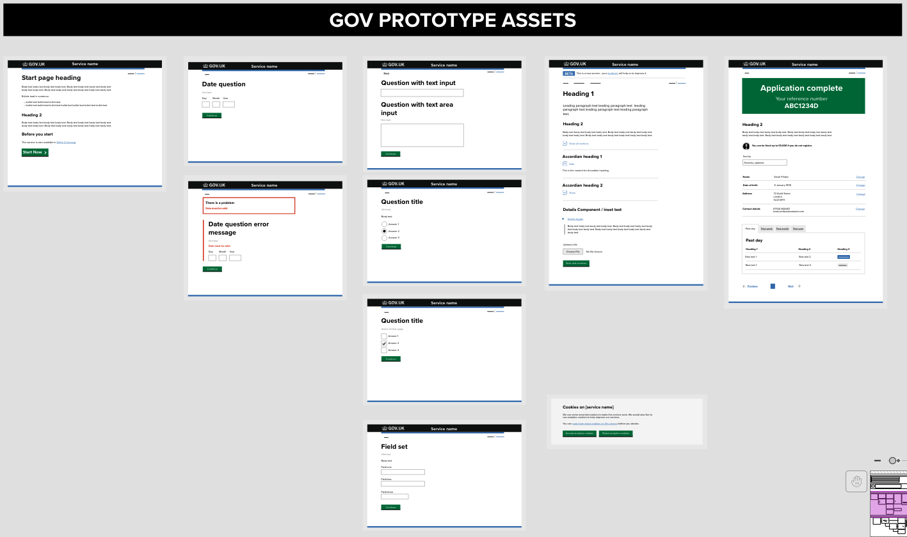
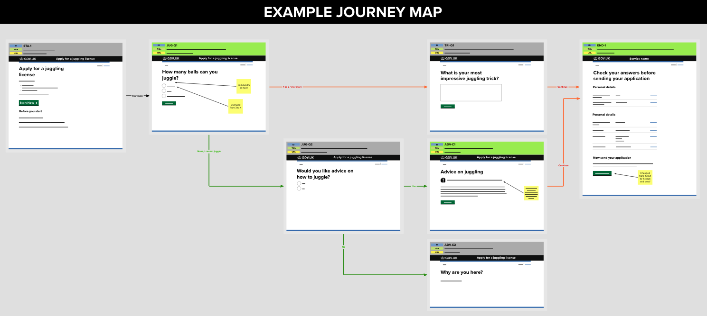

# GOV UK Design System prototype assets for MURAL
A [MURAL template](https://app.mural.co/t/dwpdigital7412/m/dwpdigital7412/1659616317884/b2e6ecb0cc0a240f70ccb96a8c7fa7583c307f57?sender=u0c01283ea463969a62998846) with [GOVUK Design System](https://gov.uk/design-system) assets to help create high fidelity mock-ups and journey maps

## If you use a free or paid MURAL account

### Instructions to copy to your own MURAL board

1. Create a new MURAL board or open an existing board that you would like to add the flow diagram to
2. In a new tab or window go to the publically accessible version of the [GOV UK Design System prototype assets for MURAL](https://app.mural.co/t/dwpdigital7412/m/dwpdigital7412/1659616317884/b2e6ecb0cc0a240f70ccb96a8c7fa7583c307f57?sender=u0c01283ea463969a62998846)
3. Find the components you need under the heading **'GOV PROTOTYPE ASSETS'**
4. Select individual elements / components as required (shift and click to select multiple, hold shift and drag a box around elements or Coommand/Control + A to select all)
5. Copy them to your clipboard (Press CMD/CTRL + C)
6. Switch over to your MURAL board in the other window or tab
7. Paste the components into your MURAL board (CMD/CTRL + V)
8. Complete! Now you have editable components to map out your service

## Journey map example

Also included in this MURAL document is an example of how journey maps have been created using these GOV UK Design System prototype assets. Please check the key at the bottom to see how we have documented page IDs (internally used to differentiate pages), Page Titles and URLs. 

## See document in MURAL

[View this file in MURAL](https://app.mural.co/t/dwpdigital7412/m/dwpdigital7412/1659616317884/b2e6ecb0cc0a240f70ccb96a8c7fa7583c307f57?sender=u0c01283ea463969a62998846)

## Credit

Credit to Clare Brown (Opencast Software, formally of HMRC) who inspired the creation of this MURAL.
